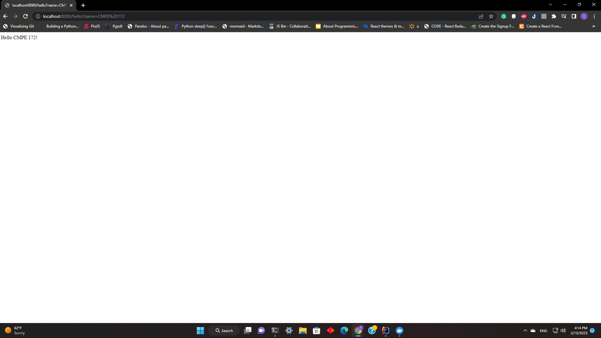

# CMPE 172 - Lab #1 Notes

**Spring Demo App Using Spring Initializr**

1. Generate a New Spring Boot Project using the following parameters via https://start.spring.io/ Links to an external site.(online Spring Boot Initializr).

2. Extract the Zip file and store in  Git Folder /labs/lab1/demo-initializr.

3. Run the Spring Demo App on Local Machine

**Spring Demo App Using JetBrains Intellij IDEA**

1. Generate a New Spring Boot Project using the following parameters from IntelliJ IDEA. Store in Git Folder /labs/lab1/demo-intellij.

2. Make the Appropriate Code Changes

3. Run the Spring Demo App on your Local Machine 

**Spring Demo App Configured for Docker**

2. Extract the Zip file and store in  Git Folder /labs/lab1/demo-docker.
   Make the Appropriate Code Changes

3. 
   * Create new files: Dockerfile, Makerfile.
   * `docker build` command builds Docker images from a Dockerfile

4. `docker run` command will create a writeable container layer over the specified image, and then starts it.

