# CMPE 172 - Lab #2 Notes

**Spring MVC Project - Serving Web Content with Spring MVC**

1. Generate a New Spring Boot Project using the following parameters via https://start.spring.io/ Links to an external site.(online Spring Boot Initializr).

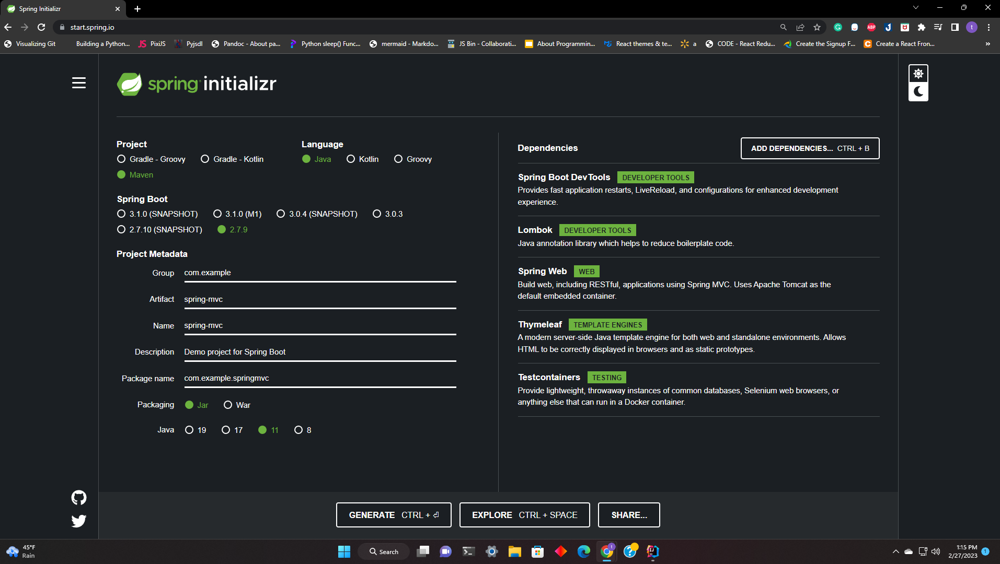

2. Create GreetingController.java file and greeting.html

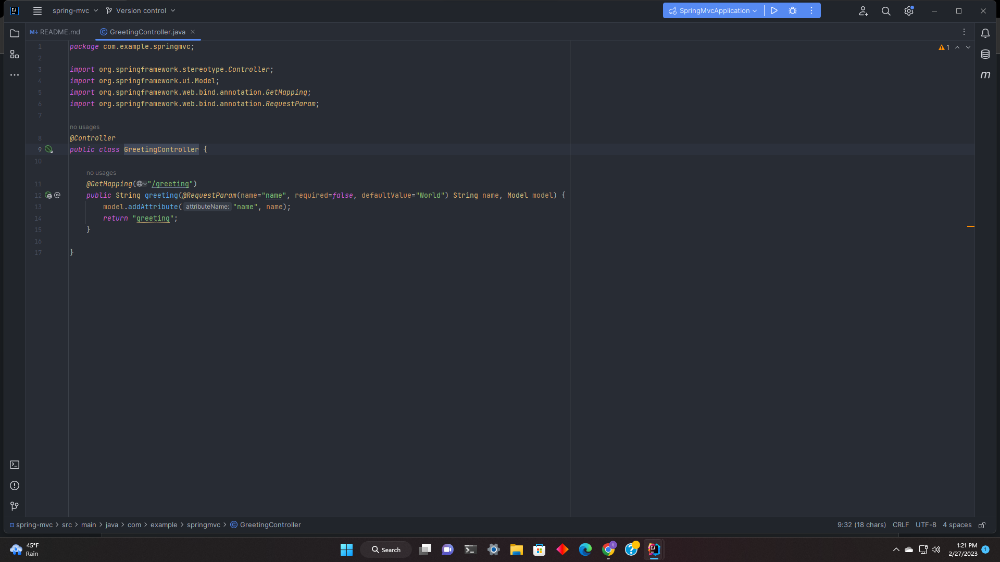

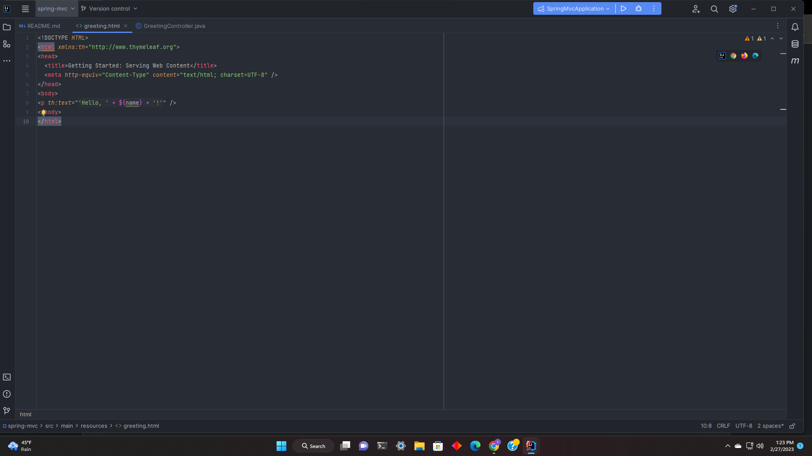

3. Run the Spring App

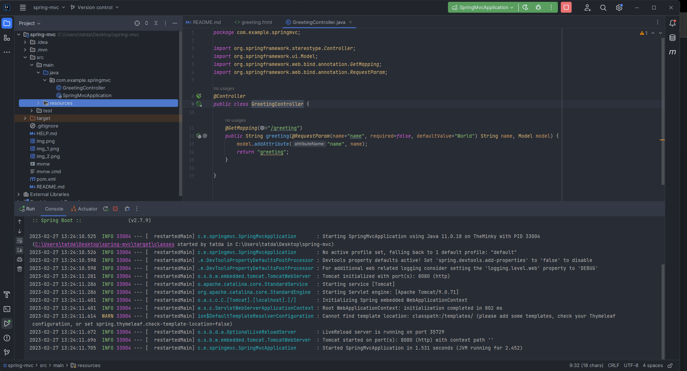

**Spring Lombok**

1. Generate a New Spring Boot Project using the following parameters via https://start.spring.io/ Links to an external site.(online Spring Boot Initializr).

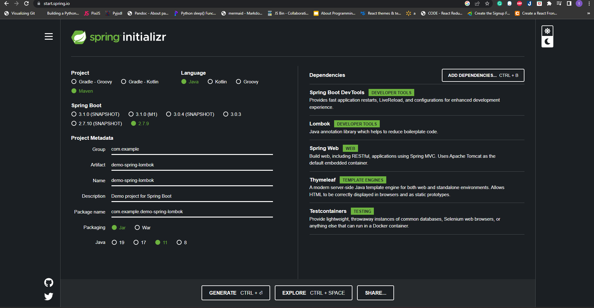

2. Create SpringLombokApplication.java

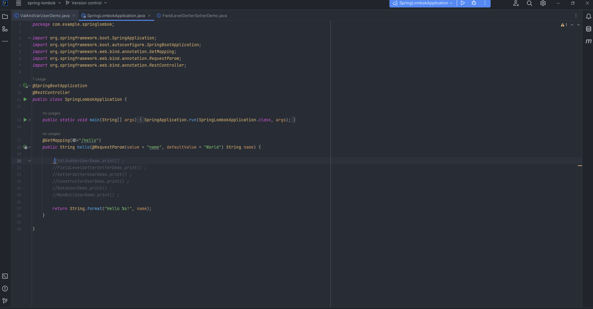
3. Add ValAndVarUserDemo.java, FieldLevelGetterSetterDemo.java, GetterSetterUserDemo.java, ConstructorUserDemo.java, DataUserDemo.java, and NonNullUserDemo.java for testing

**_ValAndVarUserDemo.java_**
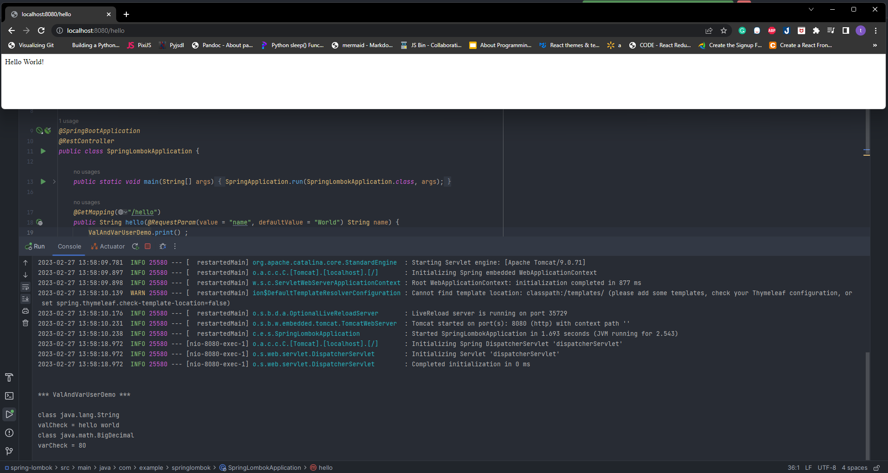

Annotation is local variable
Variables are applied such as valCheck() and varCheck().
As the result, valCheck() and varCheck() have value.

**_FieldLevelGetterSetterDemo.java_**
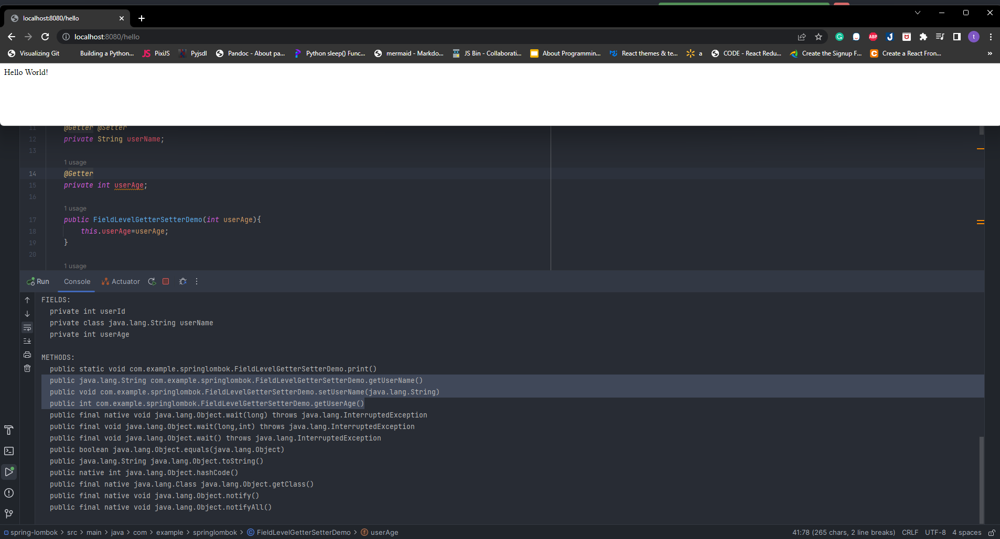

Annotation is @Setter And @Getter
These annotation will generate getUserName(), setUserName and getUserAge() methods. setUserAge() won't be created because it's already in the code

**_GetterSetterUserDemo.java_**

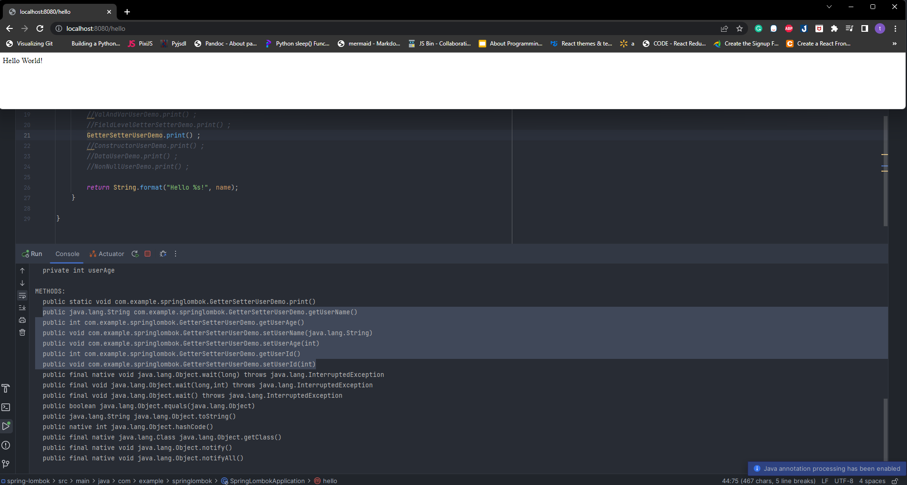
Annotation is @Setter And @Getter
These annotation will declare all variables of class such as userId, userName, userAge

**_ConstructorUserDemo.java_**

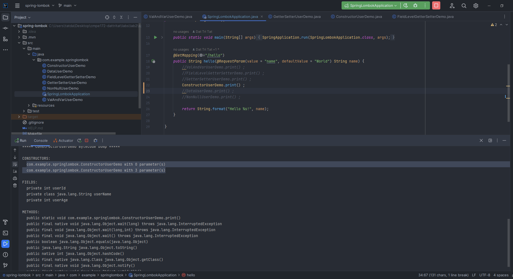
Annotation is @NoArgsConstructor And @AllArgsConstructor
@NoArgsConstructor annotation will generate a constructor with no parameters.
@AllArgsConstructor annotation will generate a constructor with 1 parameter for each field.
In the code, we successfully create a construction with no parameters, and a construction with 3 parameters.

**_DataUserDemo.java_**

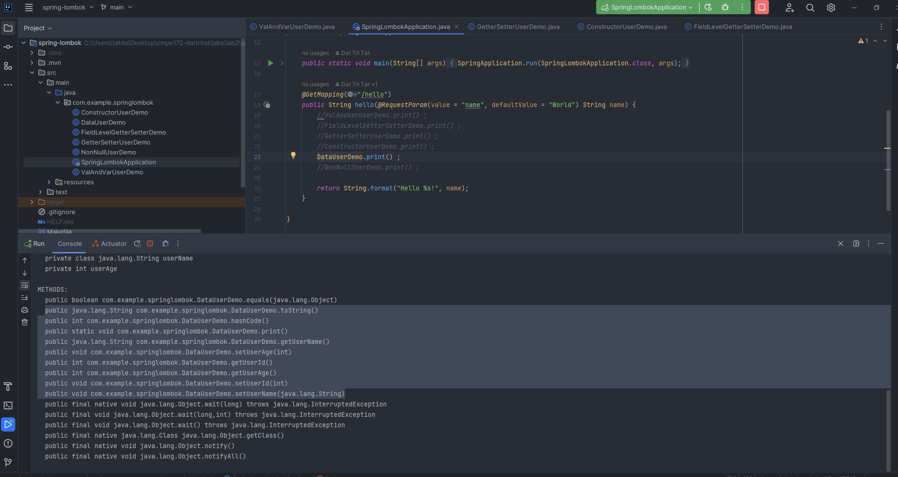
Annotation is @Data
This annotation will generate getters and setters for all fields, a useful toString method, and hashCode. Also generates @RequiredArgsConstructor

**_NonNullUserDemo.java_**

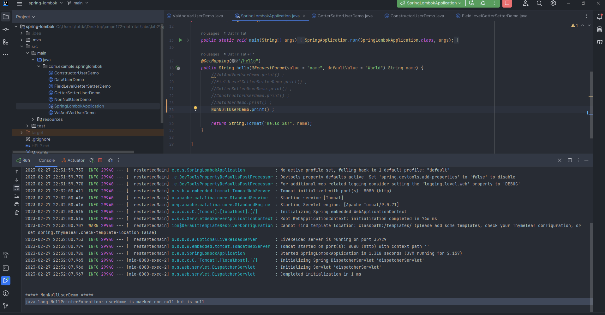
Annotation is @NonNull
This annotation generates a null check statement if we annotate the parameters of a method or a constructor with @NonNull
In this case, userName is declared with @NonNull.we create object with null userName. As the result, we can get NullPointerException

