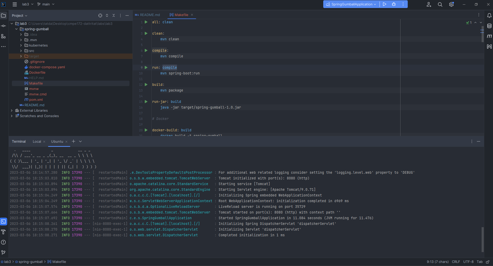
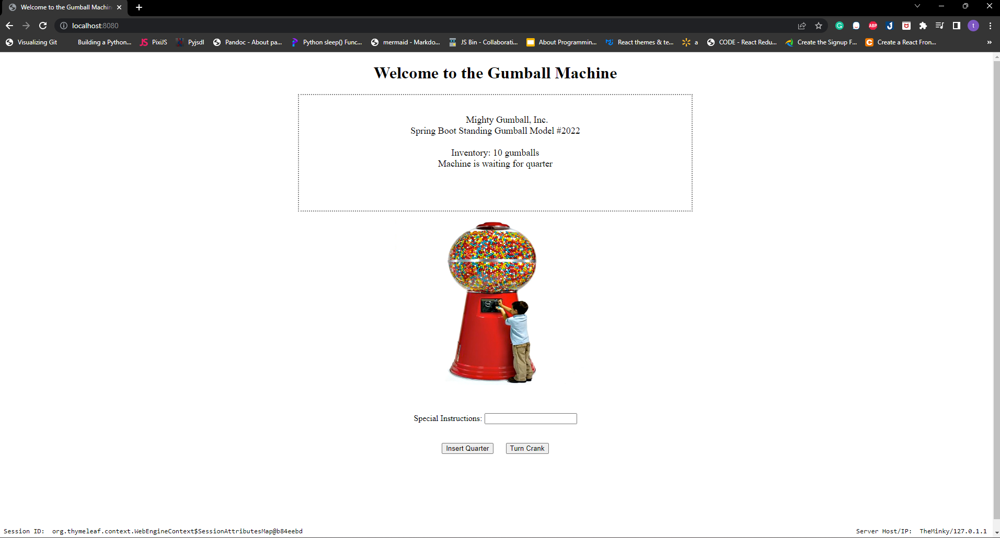
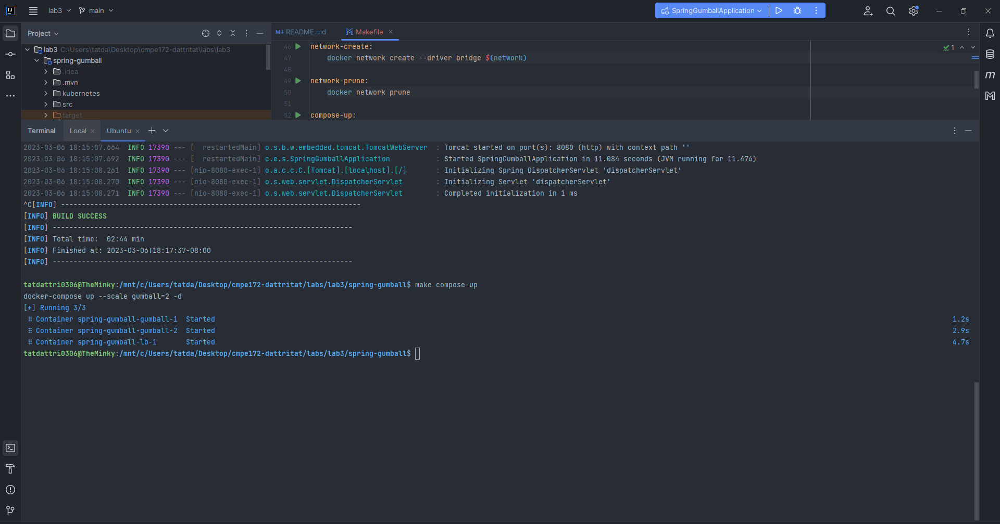
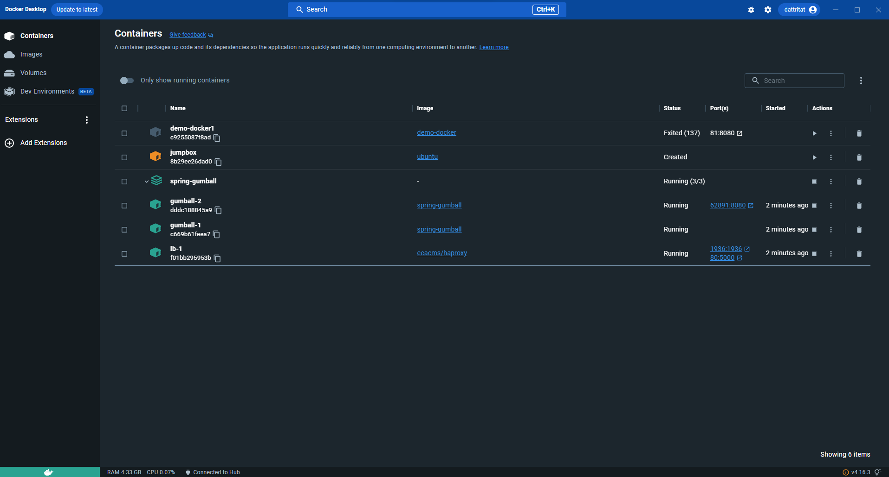
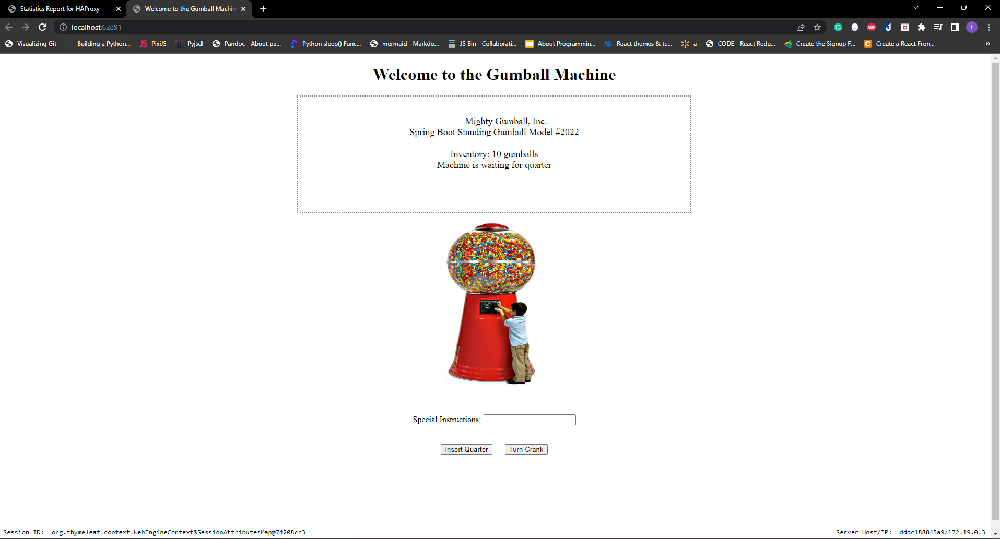
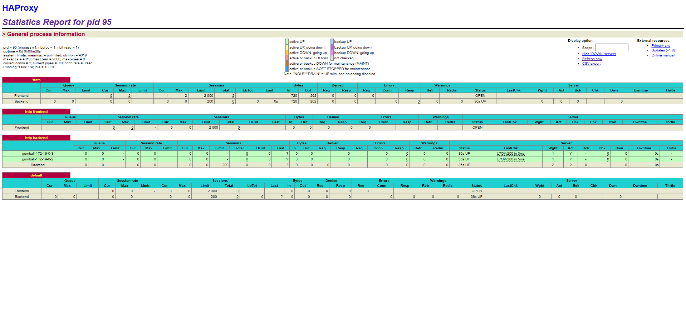
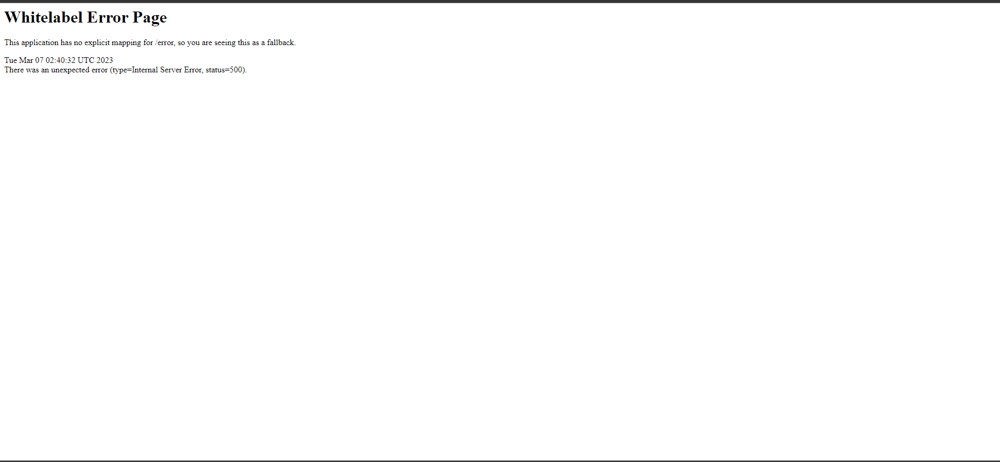
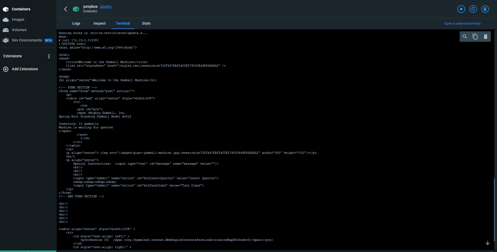
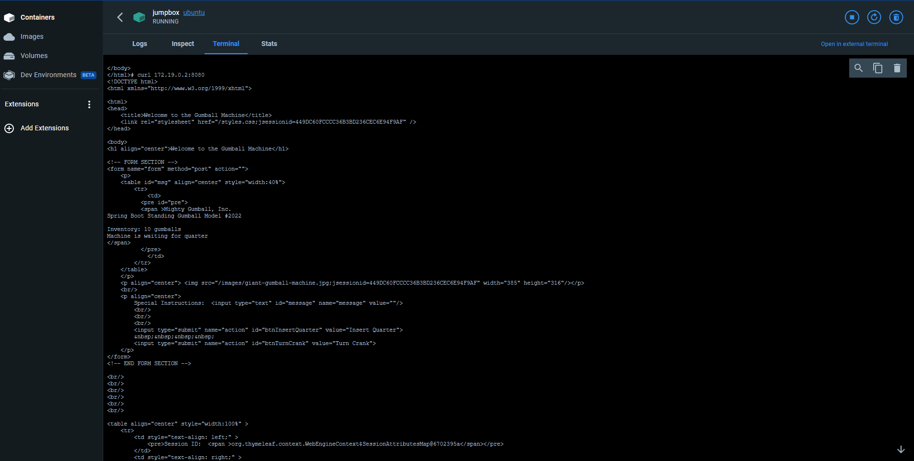

# CMPE 172 - Lab #3 Notes

**Part 1 -- Spring Gumball on Docker**

**Run on local host**

**Deployment to Docker via Docker Compose**

**Running on HA Proxy Load Balancer**

**Questions (on HA Proxy Load Balancer)**

* When you load the page multiple times what do you see on the Gumball Home Pages for Server Host/IP?
 - Server Host/IP of The Gumball Home Pages change 172.19.03  to 172.19.02.
* Can you explain where that IP value comes from?
 - The statement probably refers to an IP address that is specific to a container in the Spring Gumball Network, providing a means of identification and communication. With the help of these unique IP addresses, the network can guarantee that messages and data are correctly transmitted to the designated container and received by the intended recipient.
* Now, try to add some quarters and purchase some gumballs. Do you see the inventory depleting?  Are there any errors?
 - The website show the error and return code 500

* Review to code for your answer.  No need to make any code changes to fix any issue
* Look at the Session State Feature of the HA Loadbalancer (using COOKIES_ENABLED)
* Is there a setting that can avoid the error?  Why does it work (or Why not).
  - Yes, in docker-compose.yaml We can change COOKIE_ENABLED: "false" to "true". There is a chance that the service may not be able to differentiate between two container IP addresses.

**Testing via Jumpbox**  
- spring-gumball-gumball-1

- spring-gumball-gumball-2
