# CMPE 172 - Lab #4 Notes

## **Securing a Web Application**

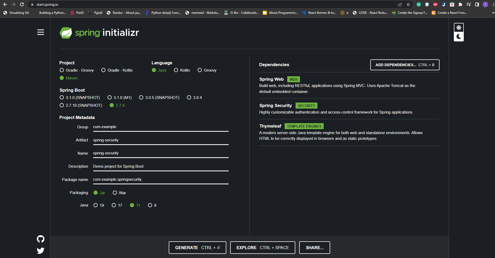

### **Run the application**

- Once the application starts up, point your browser to http://localhost:8080
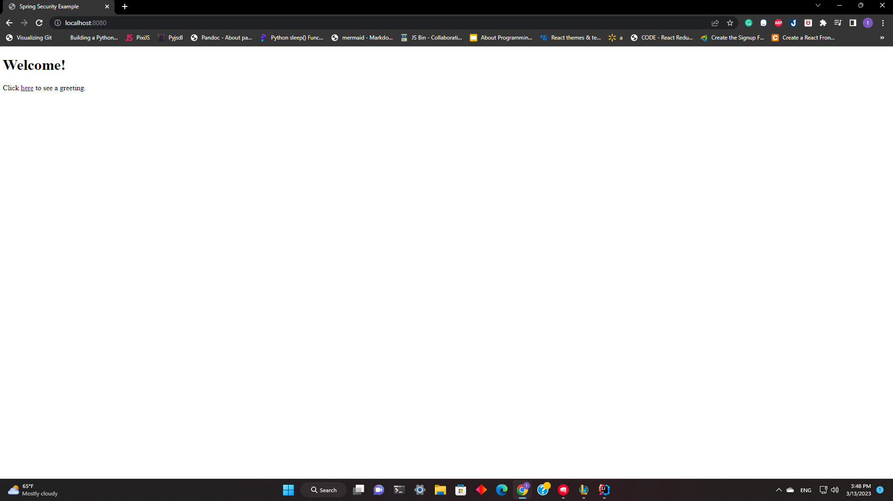

- If you click on the link, it will try to direct you to the greeting page located at /hello. However, as that particular page is protected and you haven't yet authenticated yourself by logging in, it will redirect you to the login page instead

- At the login page, sign in as the test user by entering user and password for the username and password fields,
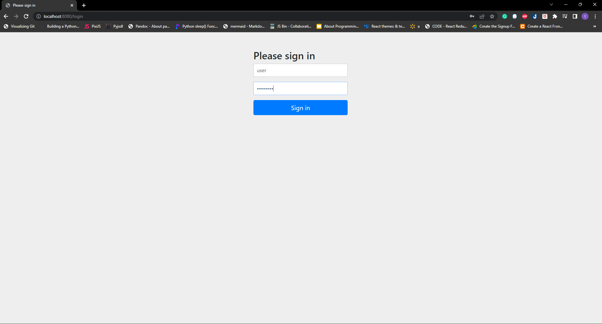
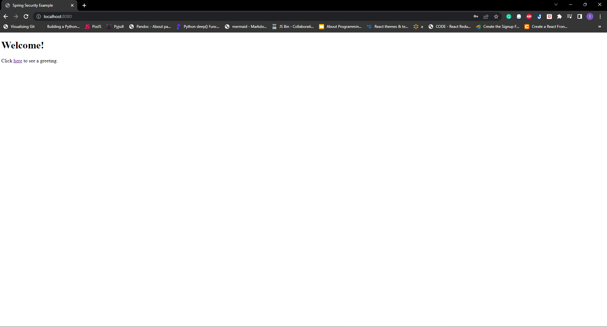

## **Spring Gumball (Version 2)**

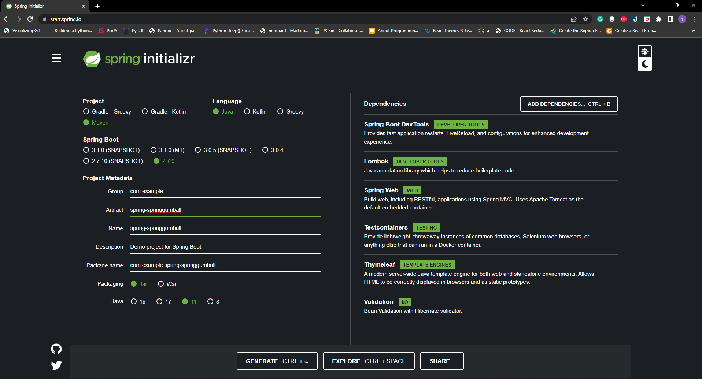

- Remove Session ID. Change to show HMAC Hash Instead
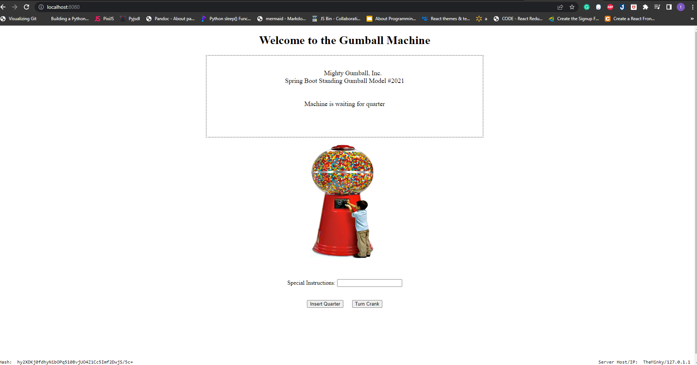

- Deployment of Spring Gumball (Version 2) to Docker
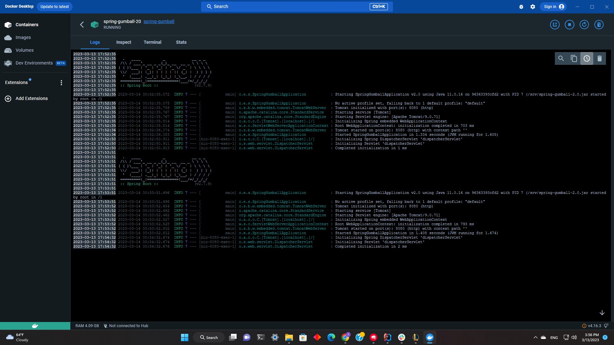
  
- Deployment Details (4 Containers)
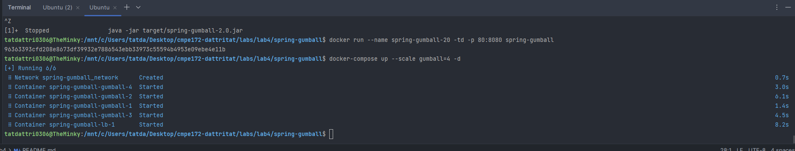

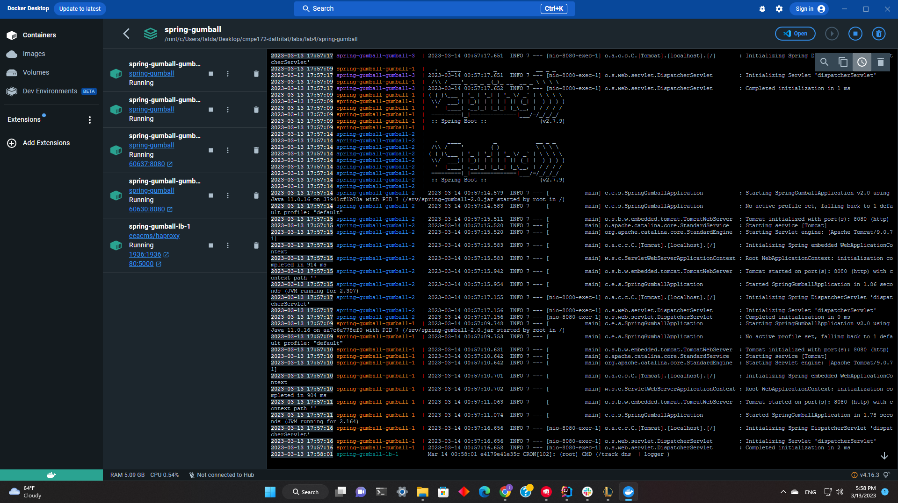
- On HA Proxy Load Balancer
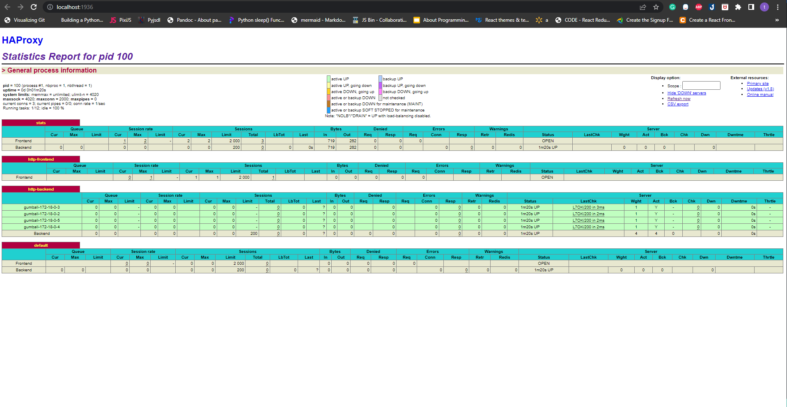

Question:
1. Do you see any errors that were observed in Spring Gumball (Version 1)? Why or Why Not?
- Version 1 needs to remove HTTP session because relying on the hidden value of state is not secure when accessing back to the browser. To improve security, the HTTP session will be removed and replaced with a HMAC hash generated by hashing a string that includes the timestamp, state, and key hash.

### **Replay Attack** 

**Before**
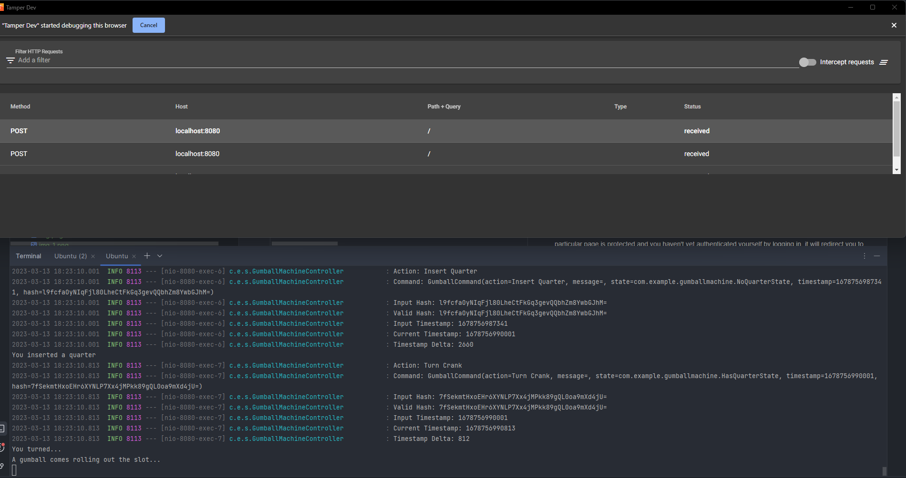
**After**

We use Tamper Dev to interrupt the Post and change "NoQuaterState" to "HasQuaterState"
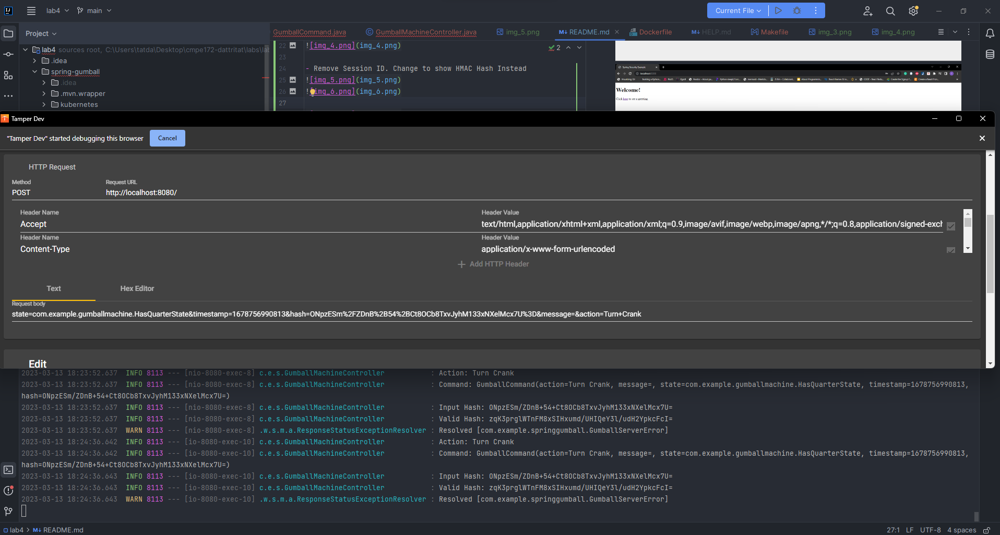