# CMPE 172 - Lab #5 Notes

**Spring REST Dependencies**

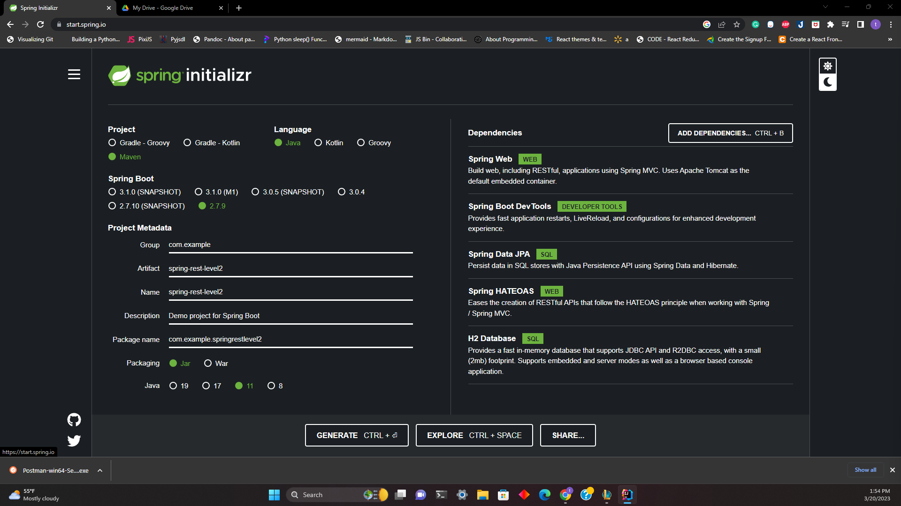

spring-rest-level2   
nonrest — Simple Spring MVC app with no hypermedia

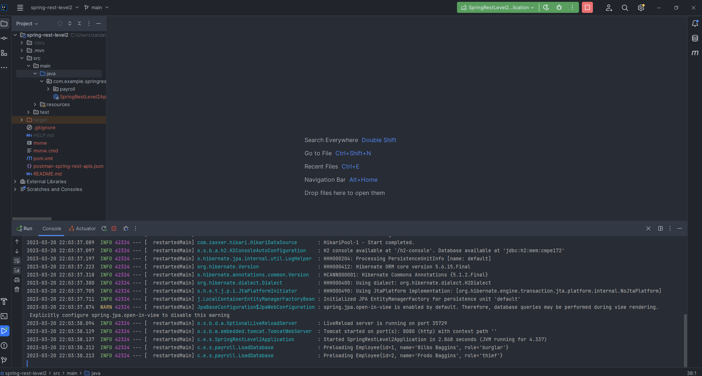

Get All employees
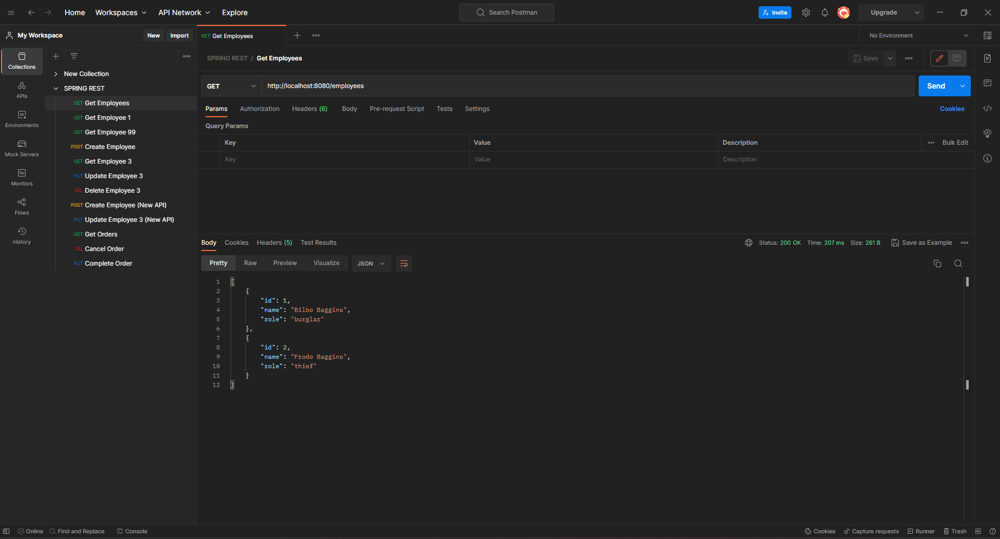

Get employee id: 1
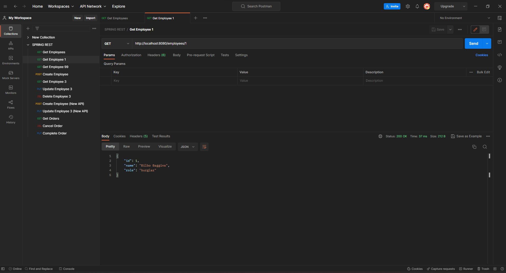

Get employee id: 99
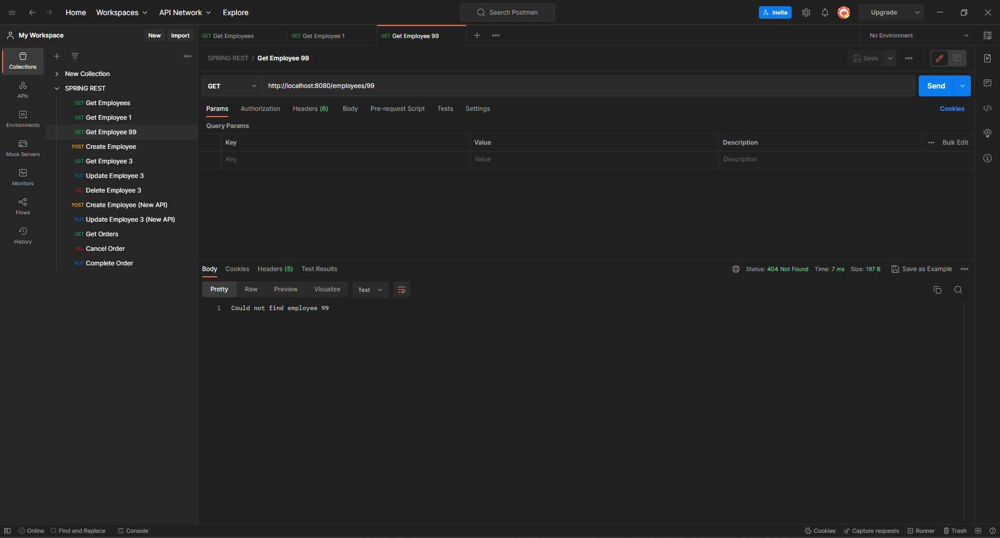

Create new employee
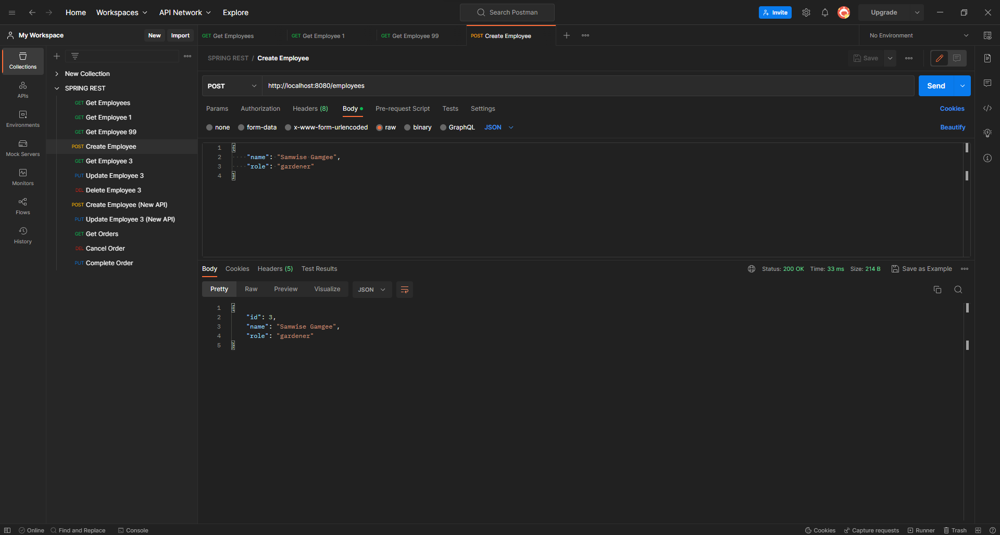

Get employee id: 3
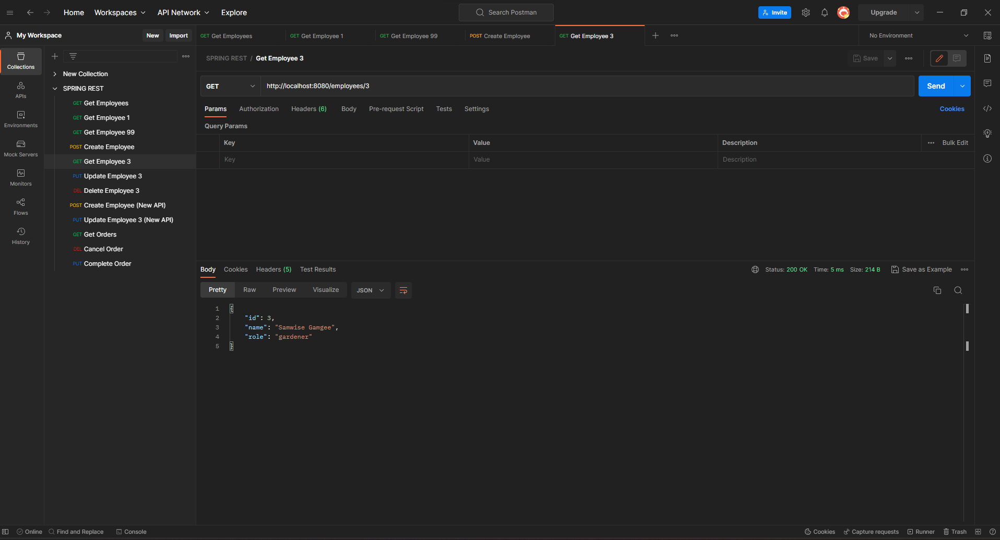

Update employee id: 3
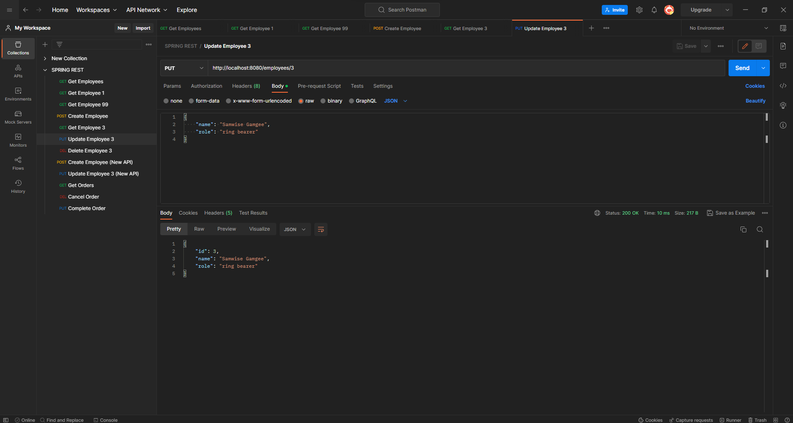

H2 SQL Database
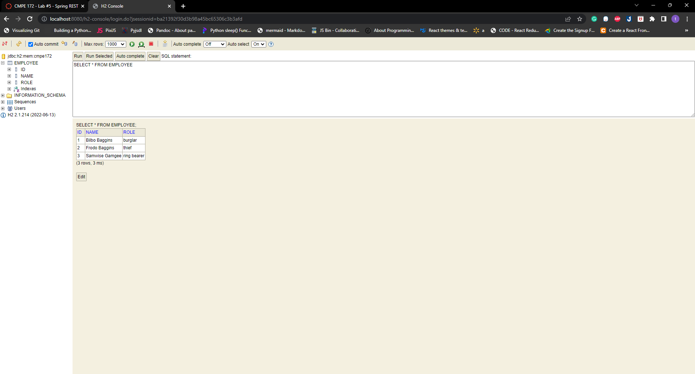

**Spring REST Dependencies**

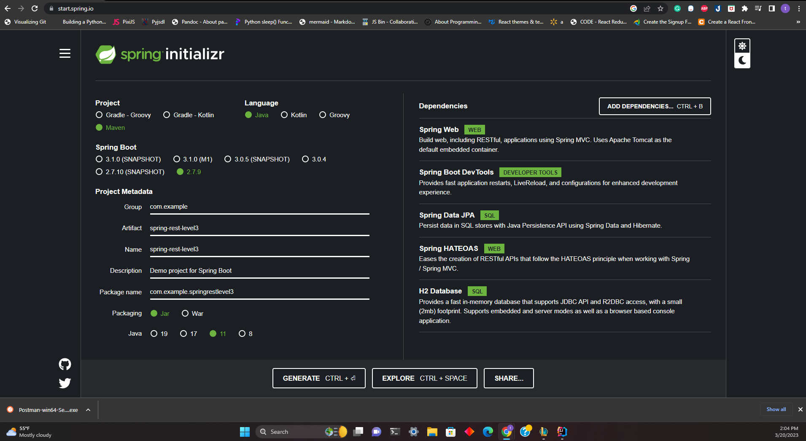

Spring-rest-level3  

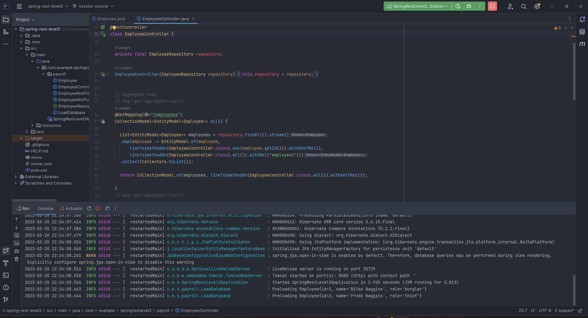

Get All employees
Each employee object contains links to redirect to another object
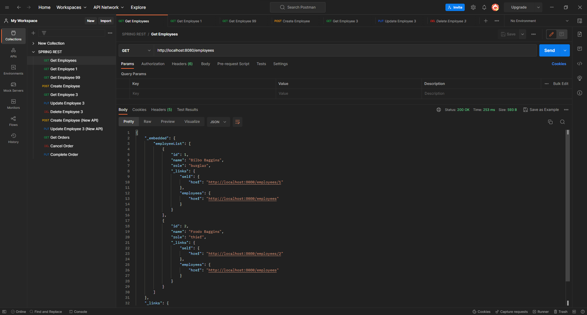

Get employee id 1
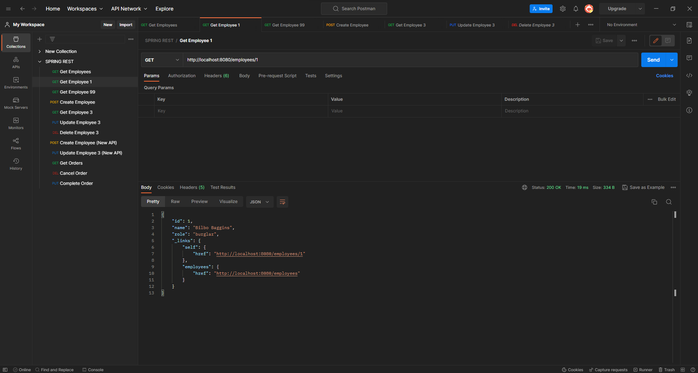

Get employee id 99
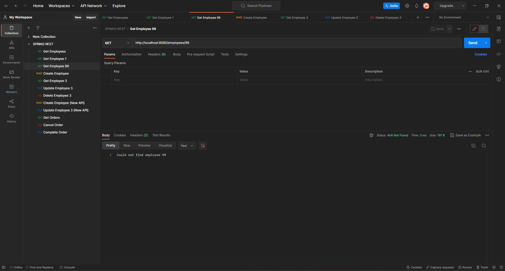

Create new employee
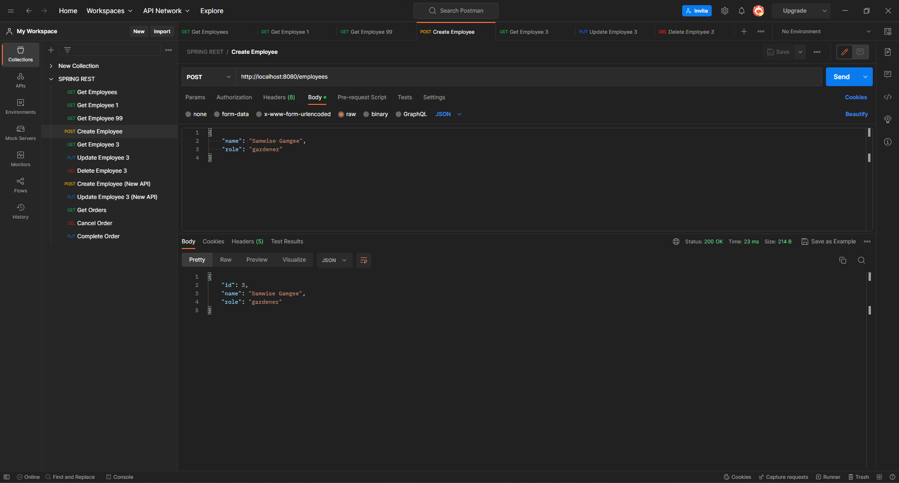

Get All employees to check employee id 3
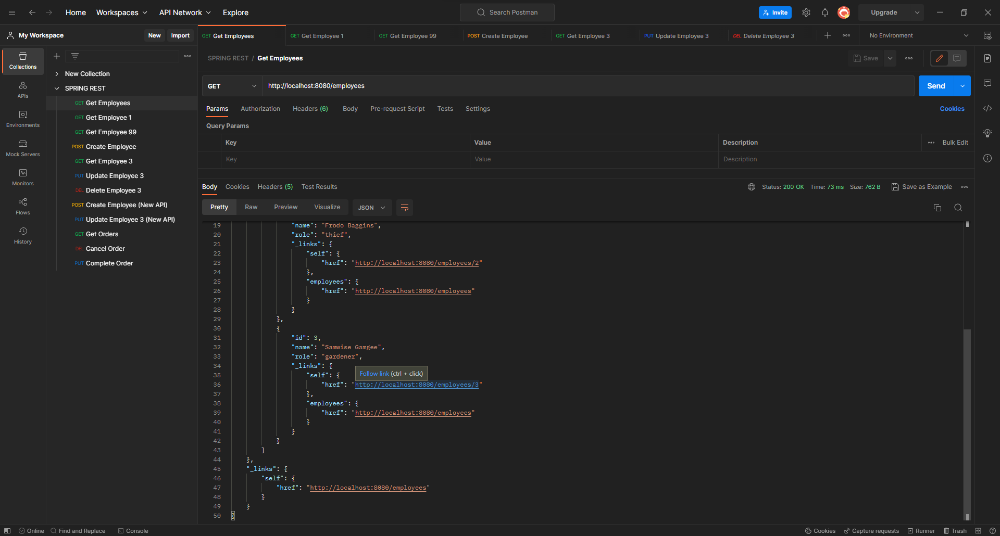

Get employee id 3
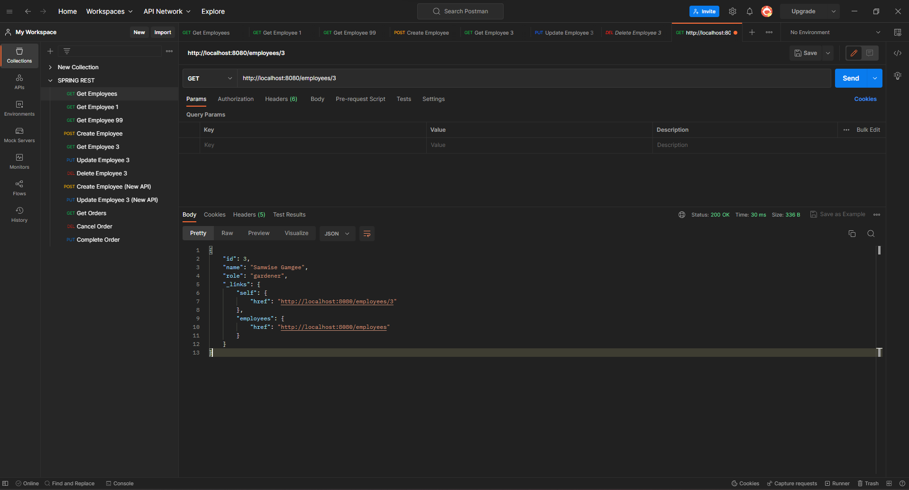

H2 SQL Database
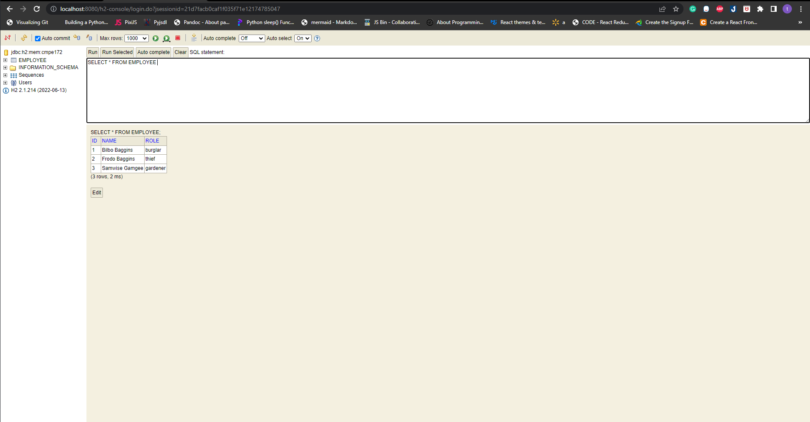