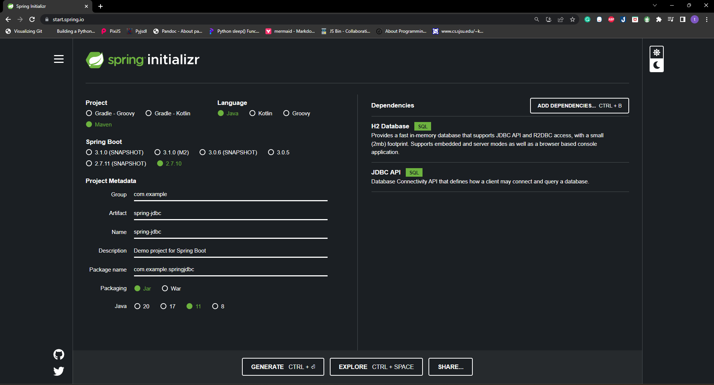

# CMPE 172 - Lab #6 Notes
**Spring JDBC**

Start a Spring InteliJ Project

Output

**Spring MySQL**

Start a Spring InteliJ Project

Create Database and Save Data

Data is stored in mySQL

**Discussion**

Spring JDBC is a lightweight module of the Spring Framework that provides a simple and efficient way of interacting with databases using JDBC. Spring JDBC provides low-level access to the database

Spring MySQL can be easily integrated with Spring Boot, which provides a streamlined way of building and deploying Spring applications. Spring MySQL provides less control over the details of the database interaction than Spring JDBC. We need to create the database before running the application

**Spring Gumball (Version 3)**

Showing Web Page (with Hash) and HTML Source of the Page showing hidden fields.

Deployment of Spring Gumball (Version 3) to Local Docker

Data is updated and stored in mySQL

