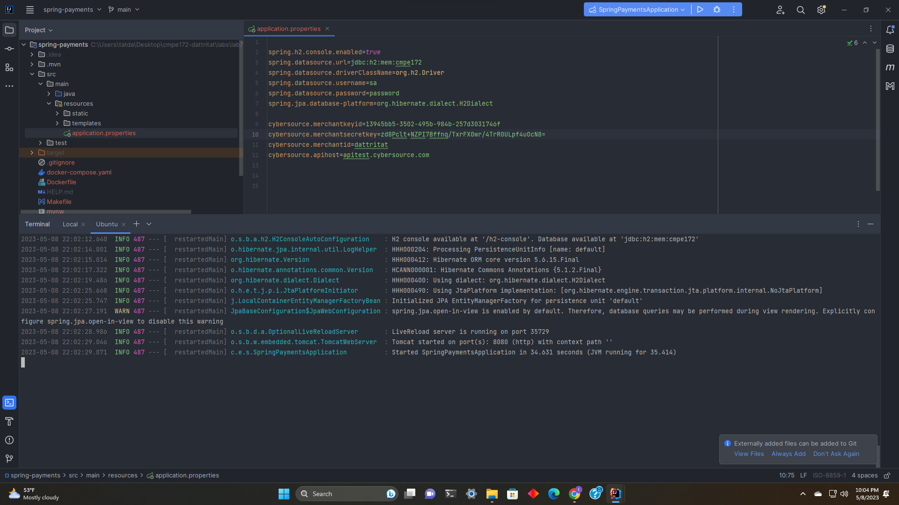
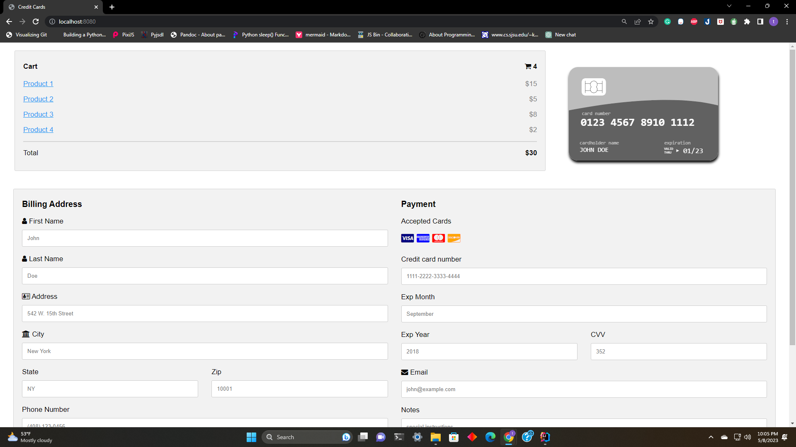
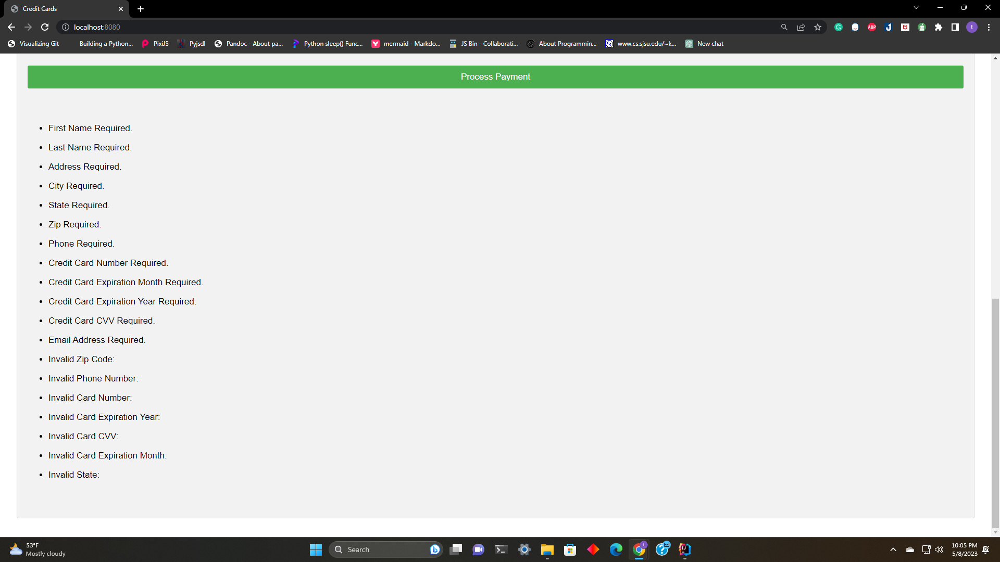
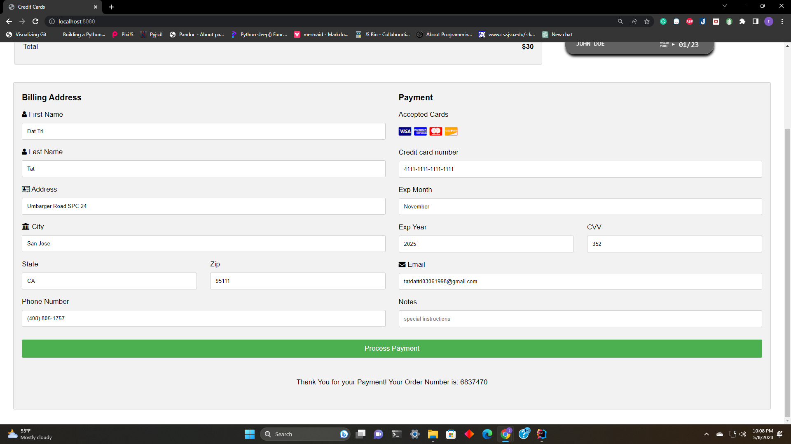
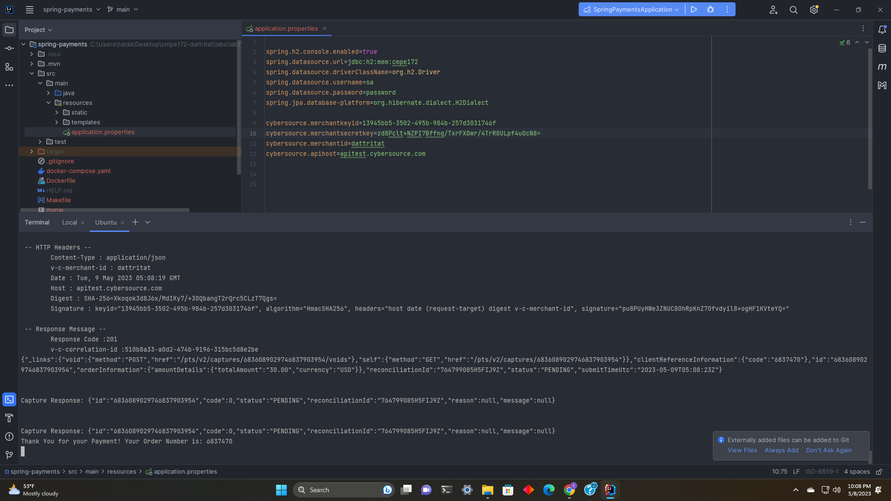
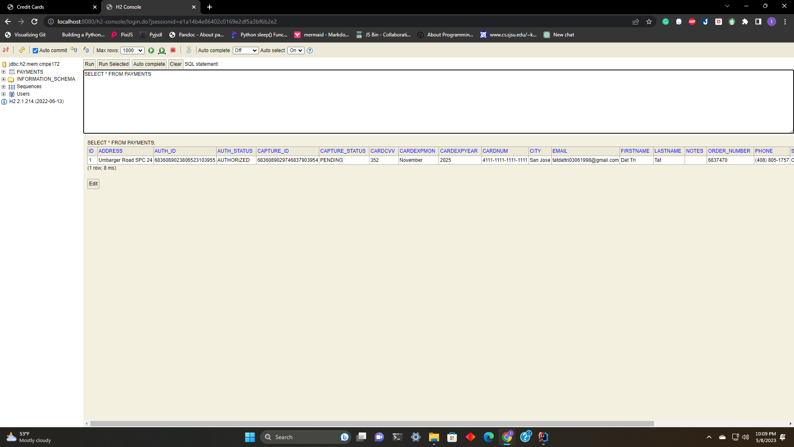

# CMPE 172 - Lab #7 Notes

### **Spring Payments**

**1. Create a CyberSource account and generate a key, then apply the key to the properties file.**

**2. Payment Page**

**3. Payment Page Output** 
* 

* Successful transaction
* 
* Terminal output
* 
* Database 
* 

1. Discussion of the Lombok, ThymeLeaf and Spring Features you used in this Lab.
   
Lombok: Lombok is a library that simplifies Java code by providing annotations to generate common boilerplate code automatically. For example, Lombok can generate getters, setters, constructors

Thymeleaf: Thymeleaf is a Java-based templating engine that create web HTML pages HTML and support for standard HTML and CSS code

Spring: Spring Feature provides a wide range of features for web development, such as web services, testing and debugging

2. Discuss why Jackson is needed and where it is used in the code for this Lab.

Jackson provides a way to convert Java objects to JSON format. Jackson is needed in this code to convert the JSON string to a Java object. The JSON string contains data that needs to be extracted and used in the application, and using Jackson makes it easier to do so. 
