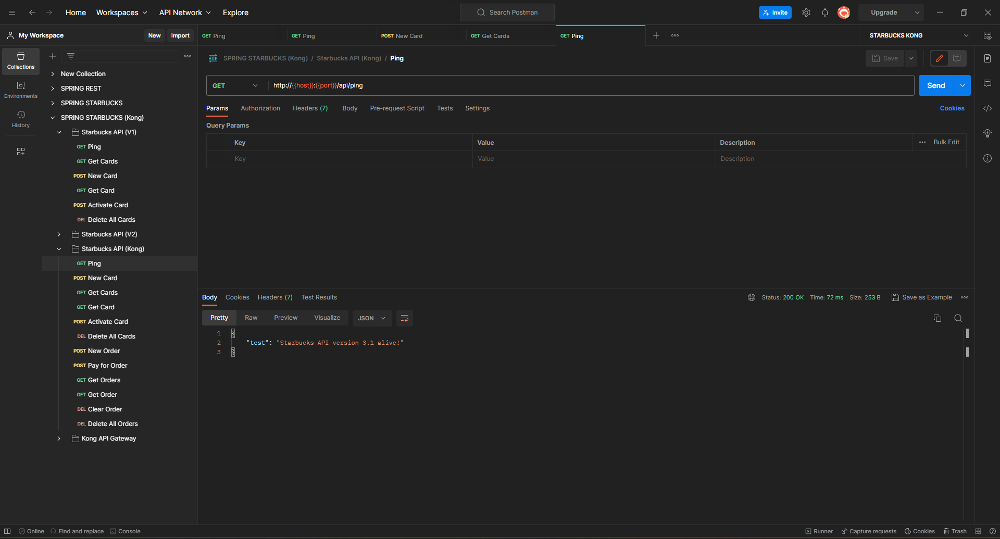

# CMPE 172 - Lab #8 Notes

# **Kong on Local Docker**

**1. Run Starbucks API in Docker**

**2. Run Kong Docker in DB-Less Mode and Test Ping**

**No API key testing**

**Postman testing**

# **Deploy Kong on Google GKE**

**1. Pull Starbucks API Docker Image**

**2. Deploy Starbucks to GKE**

**3. Create a Service for Starbucks API**

**4. Test Reachability from GKE Jumbox Pod**

**5. Install Kong GKE Ingress Controller**

**Ping testing**

**6. Create an Ingress rule to proxy the Starbucks Service and Test Kong API Ping Endpoint**

**7. Configure an API Client Key and Create Kubernetes Secret**

**8. Test Your API Against Kong via Public IP of Load Balancer**

# Discussion 

I encountered some issues when deploying SpringStarbuckAPI on Google GKE while changing the version and name of the image. I resolved this issue by checking the version and name of each file.

The necessary changes to deploy your Starbucks API with MySQL/Cloud SQL are: I will change the application.properties file by accessing MySQL with a username and password. Secondly, I will update the deployment.yaml file (spec->containers).
