# CMPE 172 - Lab #9 Notes

# **Messaging with RabbitMQ**

**1 .Build and Send a Test Message**

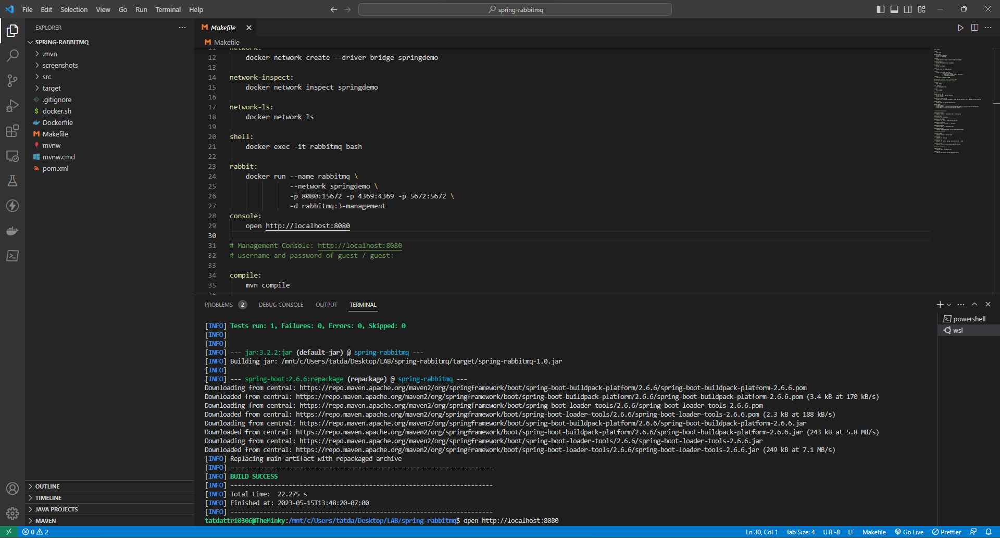

It retrieves the RabbitTemplate from the application context and sends a Hello from RabbitMQ! message on the spring-boot queue

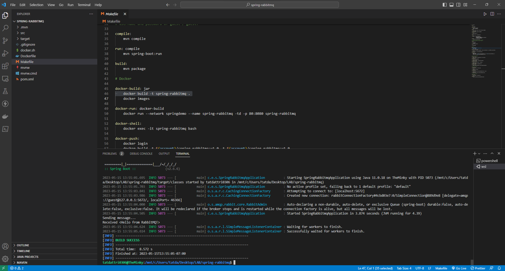

**Check connection**
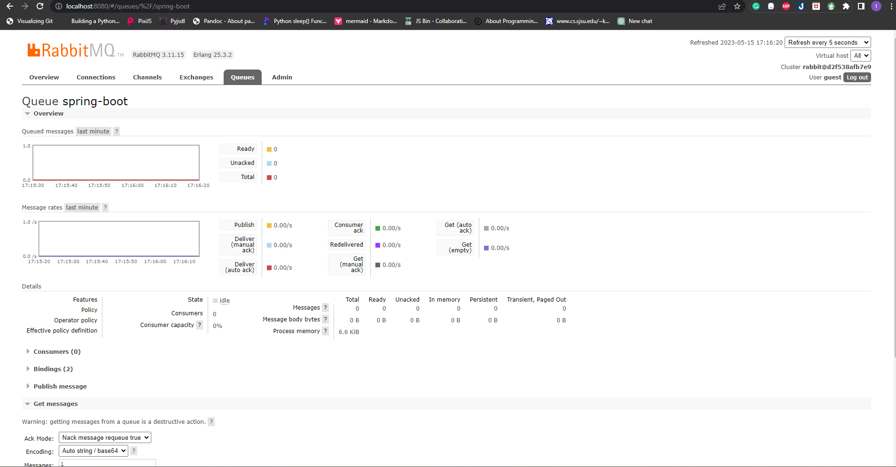

# **RabbitMQ Tutorial - Hello World**

**1 .Build and Send Messages**
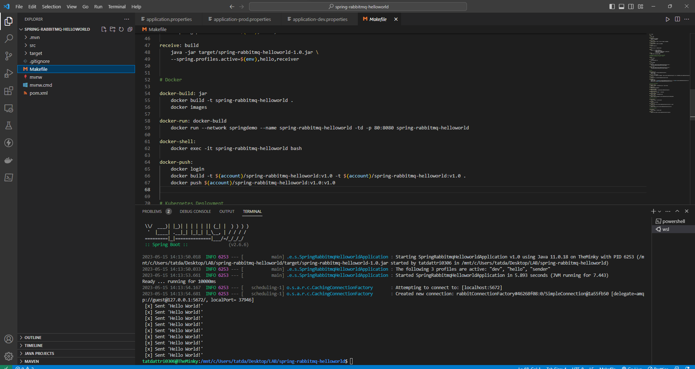

**Check connection**

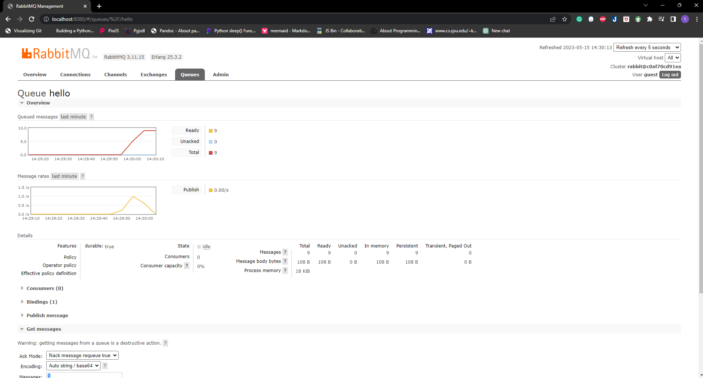

**2 .Get a Message**
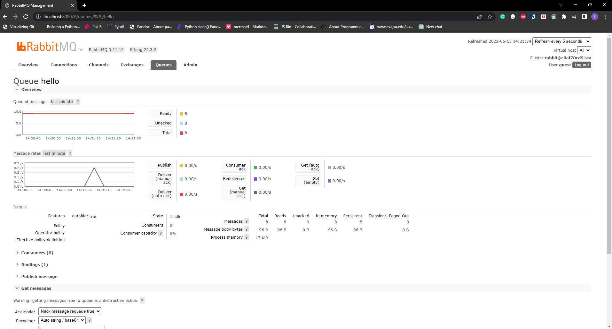

**3 .Receive all Messages**
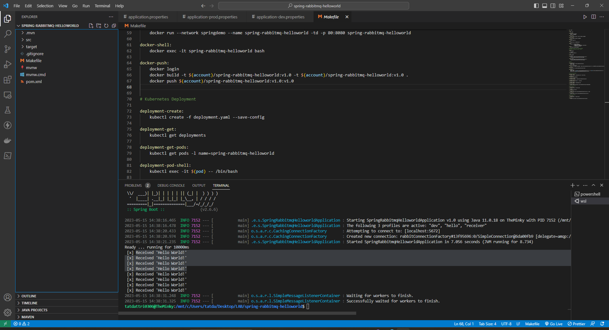

**Check messages total**

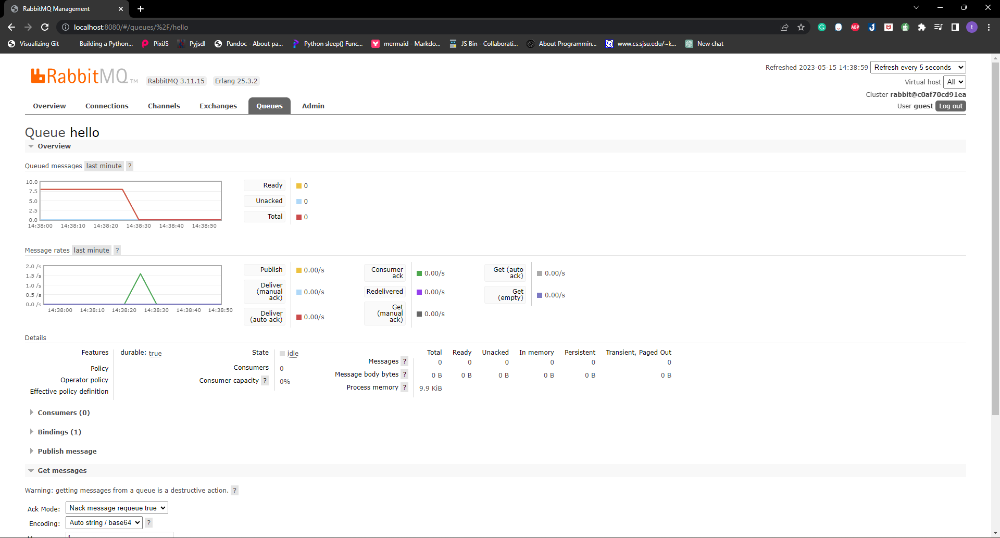

# **RabbitMQ Tutorial - Work Queues**

**1 .Deploying RabbitMQ on Docker**
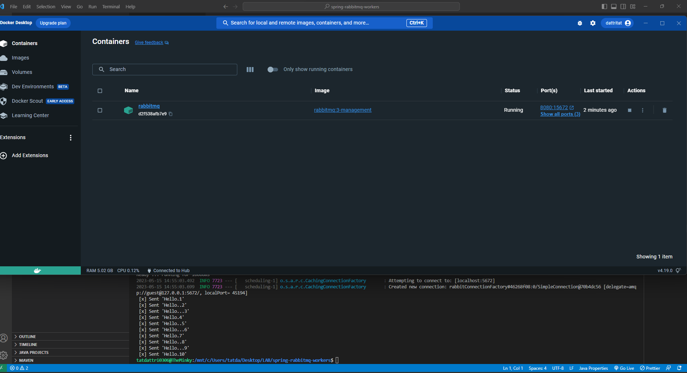

**2 .Build and Send Messages**
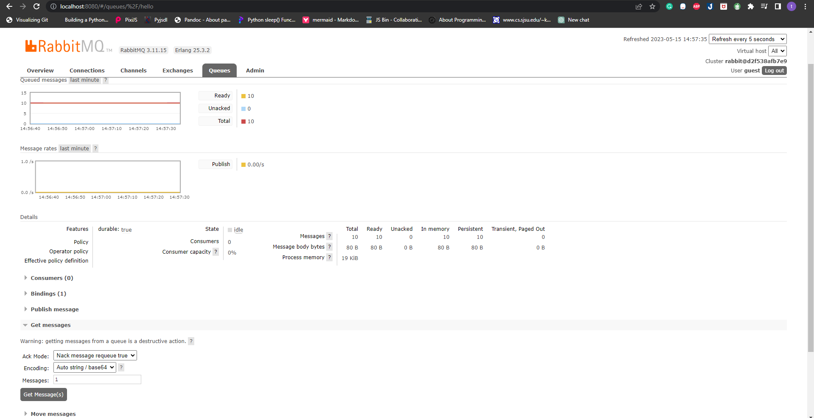

**Check messages total**
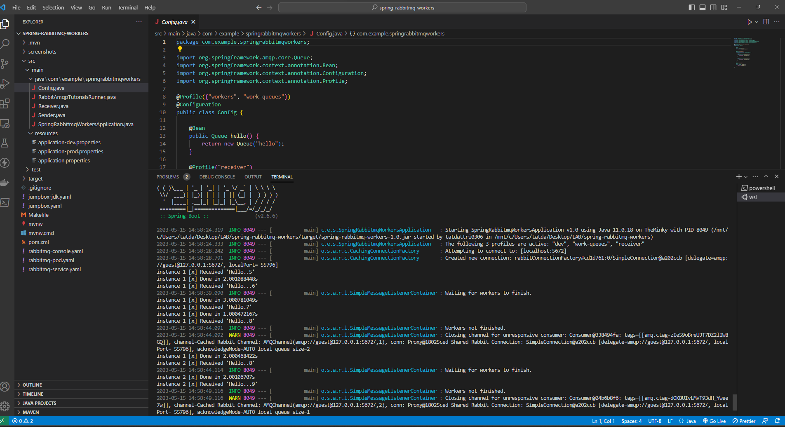

**3 .Receive Messages**
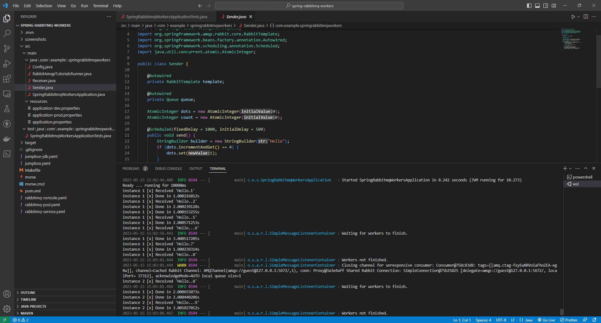

**Check messages total**
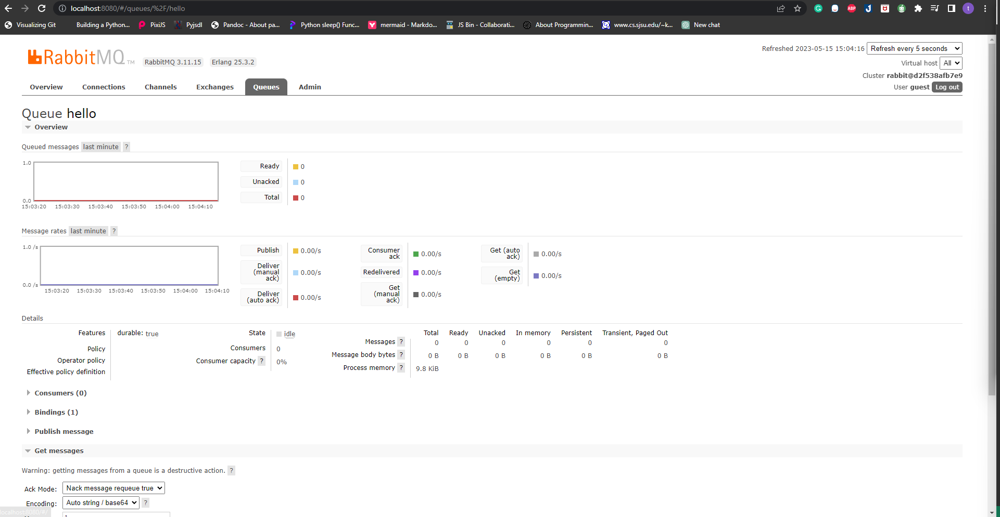

# **Discussion**
- Spring Profiles define and configure beans for specific environments or application contexts, customize the behavior of application without changing its code.  This configuration class defines a queue and beans for receivers and sender based on the "workers" or "work-queues" profile. The beans for receiver are defined only if the "receiver" profile is active. Similarly, the sender bean is defined only if the "sender" profile is active.
- Overall, this code demonstrates how RabbitMQ can be used to send and receive messages between different components in a Spring Boot application.
